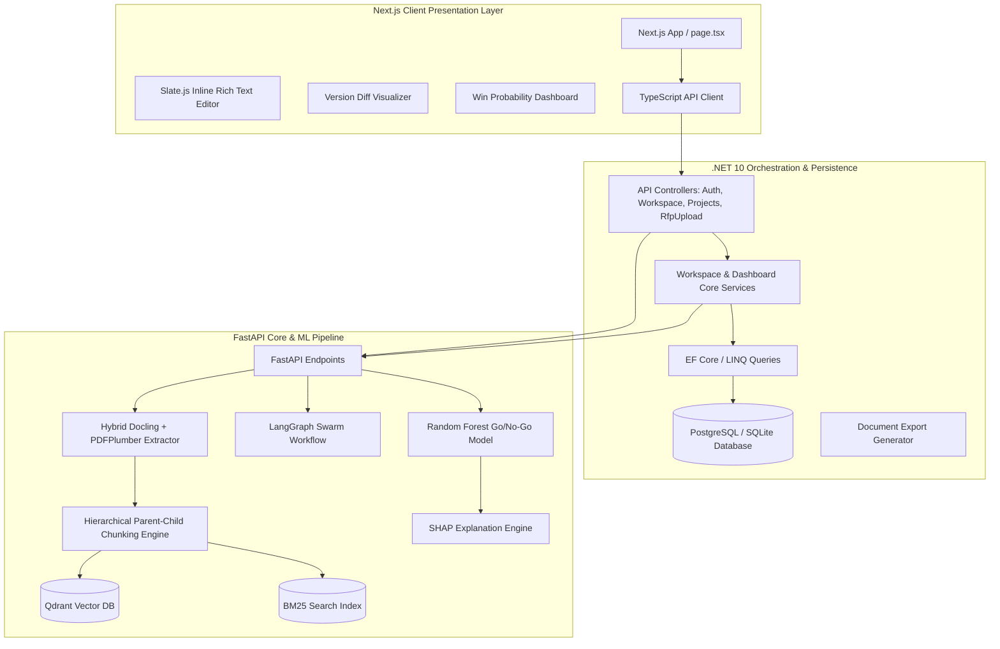

# Bid Proposal Response Engine (RFP Automation & AI Decision Platform)

A state-of-the-art, enterprise-grade AI-powered Request for Proposal (RFP) automation suite. The platform ingests dense corporate RFPs, splits them into semantic hierarchical chunks, routes them to a LangGraph-orchestrated multi-agent intelligence swarm to generate compliant proposal sections, and runs a machine learning pipeline to compute real-time win probabilities alongside local team workspaces for collaborative editing, version comparisons, and document exports.

---

## 🗺️ High-Level System Architecture

The Bid Proposal Response system is organized as a three-tier decoupled microservice architecture:



---

## 🛠️ Technological Stack

### 1. Frontend Presentation (Next.js & React)
* **Framework:** Next.js 15+ (App Router structure) using TypeScript.
* **Component Library & Design System:** Tailwind CSS for styling, Framer Motion for premium micro-animations (e.g. state transitions, smooth expanders), and Lucide React for consistent vector iconography.
* **State Visualization:** Recharts for rendering probability distribution lines, SHAP force plots, and compliance breakdowns.
* **Rich Text Editing:** Slate.js-powered custom inline editor supporting structured document nodes, real-time local draft saves, and clean JSON document representations.

### 2. Core Backend Services (.NET 10 ASP.NET Core)
* **Runtime:** .NET 10 Web API.
* **ORM & Database Provider:** Entity Framework Core utilizing SQLite (development) and migration support for PostgreSQL (production).
* **Security & Auth:** JSON Web Token (JWT) Bearer Authentication with role-based access controls (RBAC) supporting roles like `Admin`, `Editor`, `Viewer`, and `ComplianceOfficer`.
* **Export Utilities:** Helper micro-services to render HTML/Slate JSON structure into downloadable `.pdf` and `.docx` blobs.

### 3. AI Core Engine (FastAPI & LangGraph)
* **Framework:** FastAPI serving asynchronous Python processes.
* **Agent Swarm:** LangGraph implementation running a multi-agent collaborative swarm.
* **Vector Indexing:** Qdrant Vector Database for semantic search embeddings, matched with BM25 indexes for term-specific token matching (hybrid search).
* **Predictive ML Model:** Random Forest Classifier trained on corporate dataset parameters to assess bid parameters and predict Win vs Loss outcomes.
* **Attribution Explainability:** SHAP (Shapley Additive exPlanations) to trace back model decisions to specific factors like budget, compliance, and scope.

---

## 🔍 Deep-Dive into Core Modules

### 📋 1. Ingestion & Document Parser (`ai_engine/services/parser_service.py` & `chunking_service.py`)
When a user uploads a new RFP PDF:
1. **Hybrid Parsing:** The engine loads the PDF using a hybrid pipeline combining **Docling** (which excels at recognizing tabular layouts, headings, and font sizing) and **PDFPlumber** (which ensures exact, clean raw character positioning).
2. **Parent-Child Chunking:** The parsed document is translated to clean markdown, then sliced using a custom hierarchical parser:
   - **Parent Chunks:** Broad layout blocks (such as entire chapters or sections like `3.2 Technical Requirements`). These preserve context.
   - **Child Chunks:** Tiny, granular slices (single paragraphs, individual requirements) which are linked back to their respective parent IDs.
3. **Dual Indexing:** Child chunks are embedded into **Qdrant** for semantic matching while their parent metadata and raw text are registered in a **BM25** index for keyword recall.

### 🤖 2. LangGraph Multi-Agent Swarm (`ai_engine/agents/`)
Instead of relying on a single, long LLM prompt, the engine starts a state-driven multi-agent graph:
* **`planner.py`:** Reads the ingested chunks, organizes a outline of the required proposal sections, and assigns priorities.
* **`writer.py`:** Drafts technical responses using hybrid vector retrieval from previous successful bids and corporate knowledge base documents.
* **`judge.py`:** Audits generated text for clarity, tone, and logical flow.
* **`gatekeeper.py`:** Compares drafts against a strict compliance requirements checklist. It identifies compliance gaps (e.g. missing certifications, unaddressed service levels) and marks them for correction.
* **`workflow.py`:** Coordinates loop iterations. If the `gatekeeper` or `judge` flags issues, the graph routes the draft back to the `writer` for refinement, continuing until the section is approved.

### 📊 3. Win Probability & Go/No-Go Engine (`ai_engine/services/go_nogo_engine.py`)
Predicts the likelihood of winning a contract before team efforts are fully invested:
* **Features Extracted:**
  - **`compliance_rate`:** Extracted dynamically by checking the ratio of satisfied requirements within the Neo4j knowledge graph.
  - **`tech_gap_count`:** Count of unsatisfied technical parameters flagged by the compliance agents.
  - **`budget_margin_delta`:** The margin difference computed as `(rfp_budget - company_base_cost) / rfp_budget`.
* **Model Pipeline:**
  - A **Random Forest Classifier** (`rf_model.joblib`) performs binary classification (Win / Loss).
  - A custom weighted formula computes the final probability:
    $$\text{Win Probability} = (\text{Compliance Score} \times 0.5) + (\text{ML Model Score} \times 0.3) + (\text{Historical Similarity Win Rate} \times 0.2)$$
* **SHAP Attribution:**
  - Computes Shapley values for the features to explain the decision. The dashboard displays these contributions as horizontal green (positive factor) or red (negative hazard factor) bars so bid managers know exactly why a proposal is predicted to succeed or fail.

### 👥 4. Workspace & Collaboration Module (`backend/Services/WorkspaceService.cs`)
Enables multiple bid managers, technical writers, and compliance officers to work concurrently:
* **Draft Auto-Saving:** The rich-text editor periodically posts modifications to the `.NET` backend, saving incremental snapshots in the `ProposalVersions` table.
* **Version Control & Diffs:** Users can select any two points in history and view line-by-line diffs showing green additions and red deletions, utilizing a custom character matching algorithm.
* **Team Invitations & Roles:** Offers RBAC-protected actions where members are invited via email, automatically creating a pending invitation that ties into their workspace.

---

## 🗄️ Database Schemas & Data Model

Here are the Entity Framework Core models configured in `backend/Models/DbModels.cs`:

```mermaid
erDiagram
    User ||--o{ ProjectMember : belongs_to
    User ||--o{ WorkspaceMember : belongs_to
    Project ||--o{ ProjectMember : contains
    Workspace ||--o{ WorkspaceMember : contains
    Workspace ||--o{ ProposalVersion : has_history
    Workspace }|..|o| Project : links_to

    User {
        string Id PK
        string Username
        string Email
    }

    Project {
        string Id PK
        string Name
        string ClientName
        DateTime SubmissionDeadline
        double SimilarPastWinRate
        string OwnerId
    }

    ProjectMember {
        string Id PK
        string ProjectId FK
        string UserId FK
    }

    Workspace {
        string Id PK
        string Name
        string Description
        string OwnerId
        DateTime CreatedAt
        DateTime UpdatedAt
    }

    WorkspaceMember {
        string Id PK
        string WorkspaceId FK
        string UserId FK
        string Role "Admin, Editor, Viewer, ComplianceOfficer"
    }

    ProposalVersion {
        string Id PK
        string WorkspaceId FK
        int VersionNumber
        string Content "Slate JSON String"
        string CreatedBy
        DateTime CreatedAt
        string Comment
    }
```

---

## 🔌 API Route & Endpoint Reference

### 🌐 1. AI Python FastAPI Engine (Port `8000`)
* `POST /process-rfp`: Queues a background job to run the hybrid parsing, chunking, and LangGraph swarm. Returns a `jobId`.
* `GET /job-status/{job_id}`: Returns the current execution phase (`queued`, `processing`, `running_agents`, `completed`, `failed`).
* `GET /compliance/{project_id}/score`: Retrieves the compliance matrix evaluation score for a specific project.
* `GET /go-nogo/{project_id}`: Obtains the ML Random Forest prediction, Go/No-Go verdict, and SHAP features.
* `POST /api/v1/evaluate-rfp`: Directly runs the evaluation engine on manually provided parameters (e.g. custom budget constraints).

### ⚡ 2. ASP.NET Core Web API (Ports `5000` / `5282`)
* **Authentication (`api/auth`):**
  - `POST /login`: Mock credentials entry returning a JWT token with seeded mock claims.
* **Projects (`api/project`):**
  - `GET /`: Lists all active projects for the authenticated user context.
  - `GET /{id}`: Details for a specific project, including title, deadline, and historical win rate.
* **Dashboard (`api/dashboard`):**
  - `GET /win-probability`: Iterates user projects, hits the AI Engine to fetch metrics, runs the weighted formula, and returns sorted lists for the UI charts.
  - `GET /analysis/{projectId}`: Detailed diagnostic info including cost margins, compliance gaps, and SHAP metrics.
* **Workspace (`api/workspace`):**
  - `POST /`: Initializes a team workspace.
  - `GET /{workspaceId}`: Fetches active workspace information, including members and version lists.
  - `POST /{workspaceId}/draft`: Persists a new text version.
  - `GET /{workspaceId}/versions`: Returns a list of version commits.
  - `POST /{workspaceId}/invite`: Emails a registration link to join the team.
  - `GET /{workspaceId}/export`: Compiles Slate JSON to static documents and uploads them to storage, returning a download link.

---

## 🐳 Containerized Networking & Deployment

The application runs using a multi-container Docker stack linked via a private network bridge. A typical `docker-compose.yml` links the services together:

```yaml
version: '3.8'

services:
  frontend:
    build: ./frontend
    ports:
      - "3000:3000"
    environment:
      - NEXT_PUBLIC_API_URL=http://backend:5282
    depends_on:
      - backend

  backend:
    build: ./backend
    ports:
      - "5282:5282"
    environment:
      - ConnectionStrings__DefaultConnection=Host=db;Database=rfpdb;Username=postgres;Password=admin
      - PythonEngine__Url=http://ai_engine:8000
    depends_on:
      - db
      - ai_engine

  ai_engine:
    build: ./ai_engine
    ports:
      - "8000:8000"
    environment:
      - NEO4J_URI=bolt://neo4j:7687
      - QDRANT_HOST=qdrant
    depends_on:
      - qdrant
      - neo4j

  qdrant:
    image: qdrant/qdrant:latest
    ports:
      - "6333:6333"

  neo4j:
    image: neo4j:latest
    ports:
      - "7474:7474"
      - "7687:7687"
    environment:
      - NEO4J_AUTH=neo4j/password

  db:
    image: postgres:15
    environment:
      - POSTGRES_DB=rfpdb
      - POSTGRES_USER=postgres
      - POSTGRES_PASSWORD=admin
```

This ensures backend microservices resolve local DNS addresses seamlessly, and security boundaries remain intact.
