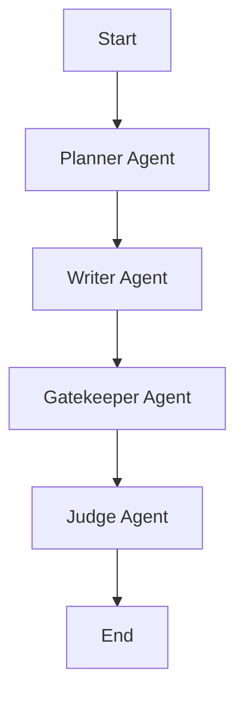

# File: Multi-Agent Swarm — Agent Nodes & Workflows

This document explains the agent architecture, prompts, and verification engines in the LangGraph multi-agent swarm.

---

## 🗺️ 1. Swarm Architecture Overview

The multi-agent swarm operates as a pipeline defined in `workflow.py`. The graph passes `AgentState` between four specialized agent nodes:

- **State Sharing**: The graph uses the `AgentState` schema to pass RFP content, plans, reviews, approval flags, and updates to the `drafts` dictionary using the `operator.ior` merge operator.
- **Provider API Keys**: Each agent node uses a separate model client instance initialized with a specific key (e.g. `PLANNER_GROQ_API_KEY`, `WRITER_GROQ_API_KEY`, `GATEKEEPER_GROQ_API_KEY`, `JUDGE_GROQ_API_KEY`) to manage rate limits and allow for modular model routing.

---

## 📋 2. Agent Node Deep Dives

### A. Planner Agent (`ai_engine/agents/planner.py`)
Analyzes parsed RFP sections to create a structured outline.
- **Prompting**: Uses `PLANNING_PROMPT_TEMPLATE` to direct the LLM to identify requirement summaries, response strategies, and suggested word counts. It outputs structured JSON.
- **Compliance Integration**: Iterates through the checklist and calls `ComplianceMatrixService` to create a `Requirement` node in the Neo4j graph for each requirement.
- **Fallback**: If the LLM is offline, it generates a basic plan outline from section headings to prevent pipeline failures.

---

### B. Writer Agent (`ai_engine/agents/writer.py`)
Generates technical response sections using Retrieval-Augmented Generation (RAG).
- **RAG Retrieval**: For each requirement in the checklist, it queries the `RetrievalService` for relevant context. The service runs a hybrid search combining Qdrant dense vectors and BM25 index keyword matches.
- **Synthesis Prompting**: Instructs the LLM to structure responses using clear headings, bullet points, inline citations (e.g. `[Source: Page X]`), and a compliance statement.
- **Fallback**: If the LLM fails, it generates standard compliance placeholders to keep the workflow moving.

---

### C. Gatekeeper Agent (`ai_engine/agents/gatekeeper.py`)
Verifies compliance and enforces quality guardrails.
- **Rule-Based Structural Checks**:
  - Checks for unresolved placeholders like `TODO`, `FIXME`, `[insert]`, `TBD`, and `lorem ipsum`.
  - Enforces a minimum length of 50 words.
  - Flags dummy test URLs (e.g., `example.com` or `mockstorage`).
- **Graph Database Verification**: Queries Neo4j to confirm that each requirement node has a valid supporting link to source evidence.
- **LLM-Based Review**: Prompts the LLM using `GUARDRAIL_PROMPT_TEMPLATE` to detect contradictions, compliance scores, and unsupported claims.
- **Neo4j Audit Trail**: Creates a `ProposalSection` node in Neo4j for each draft and links it to the target `Requirement` with a status of `COMPLIANT` or `NON_COMPLIANT`.

---

### D. Judge Agent (`ai_engine/agents/judge.py`)
Evaluates and scores drafts for quality assurance.
- **Evaluation Criteria**: Uses `JUDGE_PROMPT_TEMPLATE` to prompt the LLM to score responses from 0-10 on three criteria:
  1. **Compliance Accuracy**: Fulfillment of specified requirements and constraints.
  2. **Clarity & Style**: Professional tone, formatting, and readability.
  3. **Completeness**: Coverage of required topics.
- **Hallucination Detection**: Identifies unsupported assertions or factual anomalies.
- **Approval Rule**: Approves the proposal only if the average scores for both **Compliance** and **Completeness** are $\ge 7.0$.
