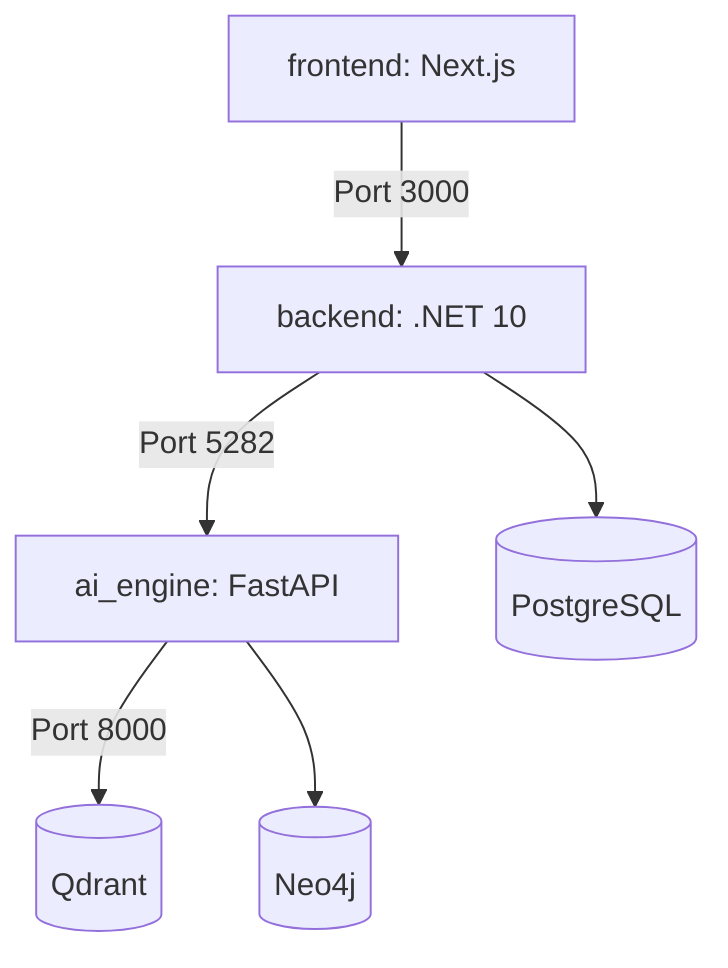

# File: Root Deployment & Container Orchestration

This document defines the deployment orchestration, container mappings, and environmental configurations specified in `docker-compose.yml` and `.env` at the root of the project.

---

## 🐋 1. Multi-Container Orchestration (`docker-compose.yml`)

The production and development stacks are unified using Docker Compose. The configuration specifies six service containers:

### Container Services

1. **`frontend`** (Next.js Node application):
   - **Exposed Port**: `3000:3000`
   - **Environment Variables**: `NEXT_PUBLIC_API_URL` (points to the C# gateway address).

2. **`backend`** (.NET 10 Web API Core gateway):
   - **Exposed Port**: `5282:8080` (mapped inside the container to .NET's HTTP port).
   - **Environment Variables**:
     - `ConnectionStrings__DefaultConnection` (points to the local database file or PostgreSQL instance).
     - `PythonEngine__Url` (maps to `http://ai_engine:8000`).
     - `Jwt__Key`, `Jwt__Issuer`, `Jwt__Audience`.

3. **`ai_engine`** (FastAPI service container):
   - **Exposed Port**: `8000:8000`
   - **Environment Variables**:
     - `GROQ_API_KEY` (points to Groq cloud APIs).
     - `QDRANT_URL` (maps to `http://qdrant:6333`).
     - `NEO4J_URI` (maps to `bolt://neo4j:7687`).
     - `NEO4J_USERNAME`, `NEO4J_PASSWORD`.

4. **`qdrant`** (Dense Vector Storage DB):
   - **Exposed Port**: `6333:6333` & `6334:6334` (gRPC interface).
   - **Volumes**: Persists vector points in `/qdrant/storage` mapping back to host directories.

5. **`neo4j`** (Graph Compliance Database):
   - **Exposed Ports**: `7474:7474` (HTTP browser utility) & `7687:7687` (Bolt binary driver port).
   - **Volumes**: Maps data and logs folders onto persistent host volumes.

6. **`postgres`** (Relational Db for Users & Workspaces):
   - **Exposed Port**: `5432:5432`

---

## 🔑 2. Environment Configurations (`.env`)

Configures access details and prevents API secrets from leaking into code repositories.

| Variable Name | Default Value | Purpose |
|---|---|---|
| `GROQ_API_KEY` | *(Secret)* | Authenticates requests to the LLM backend (using `llama-3.3-70b-versatile`). |
| `NEXT_PUBLIC_API_URL` | `http://localhost:5282` | Tells the Next.js client where to direct API calls. |
| `PythonEngine__Url` | `http://localhost:8000` | Tells the C# backend where to route AI tasks. |
| `QDRANT_URL` | `http://localhost:6333` | Vector collection query address. |
| `NEO4J_URI` | `bolt://localhost:7687` | Bolt connection string for Neo4j. |
